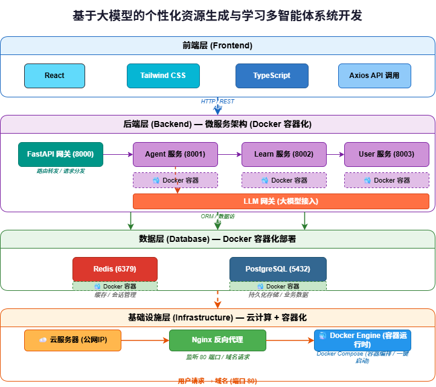

# personalized-learning-multi-agent

<div align="center">
  
  
  
  
  
  

**第十五届中国软件杯大赛 A组赛题作品**

基于大模型的个性化资源生成与学习多智能体系统开发
</div>

---


## 系统整体架构
本项目采用前后端分离的微服务架构，基于 Docker 容器化部署，实现高内聚、低耦合的系统设计，同时满足赛题对多智能体协同、个性化学习资源生成的核心要求。


> 图：系统分层架构设计（前端层 → 后端微服务层 → 数据层 → 基础设施层）

### 架构分层说明
1.  **前端层（Frontend）**
    采用 **React 19 + TypeScript 6 + Tailwind CSS** 构建单页应用，通过 **Axios** 与后端进行 HTTP/REST 通信，为用户提供直观的学习交互界面，包括对话式画像构建、资源生成展示、学习路径可视化等功能。

2.  **后端微服务层（Backend）**
    基于 **FastAPI** 搭建微服务架构，通过 API 网关实现请求路由分发，各服务职责明确：
    - **Agent 服务**：多智能体核心调度，包含画像构建、资源生成、学习路径规划、智能辅导等子智能体
    - **Learn 服务**：学习业务逻辑处理，如课程管理、资源推送
    - **User 服务**：用户账号与权限管理
    系统采用统一的 LLM 调用层，所有智能体相关的 AI 能力（对话、资源生成、学习规划）均由 Agent 服务统一对接大模型服务，保证模型调用集中、易于维护与扩展。

3.  **数据层（Database）**
    - **Redis**：用于存储会话状态、对话历史缓存、邮箱验证码，提升响应速度
    - **PostgreSQL**：持久化存储用户画像、学习记录、资源数据等核心业务数据

4.  **基础设施层（Infrastructure）**
    基于云服务器 + Docker 实现容器化部署，使用 Docker Compose 完成多容器编排与一键启动，保障系统可扩展性与稳定性。

---

## 项目简介

**智慧学习中心**面向高校学生，提供「画像 → 路径 → 资源 → 辅导 → 评估」的个性化学习闭环。系统以**多智能体**分工协作：画像智能体负责对话式特征抽取，路径智能体负责阶段规划与多模态资源推送，辅导智能体基于知识库 RAG 即时答疑，契合第十五届中国软件杯 A 组赛题「基于大模型的个性化资源生成与学习多智能体系统开发」。

**当前进度（摘要）**

| 模块 | 状态 |
|------|------|
| 用户认证（user-service :8001） | 已对接 |
| 访客 / 登录 Agent 对话（agent-service :8003） | 已对接（辅导 RAG；视频库检索待完善） |
| 画像 / 路径智能体、路径详情、评估等 | 前端可演示，后端 API 联调中 |

---

## 赛题核心能力对照

| 赛题能力 | 系统入口 | 说明 |
|----------|----------|------|
| 对话式学习画像 | `/profile-build` → `/profile` | 多轮对话构建六维画像 |
| 多智能体资源生成 | `/chat` + `/path/view` | 五类资源：文档、导图、题库、视频、实操 |
| 个性化学习路径 | `/path` → `/path/plan` → `/path/view` | 路径智能体规划三阶段并推送资源 |
| 智能辅导（加分） | `/chat` | 知识库 RAG 答疑 |
| 学习效果评估（加分） | `/analytics` | 行为分析与优化建议 |

详细设计见 **[docs/design/overview.md](docs/design/overview.md)**。

---

## 仓库结构

```
personalized-learning-multi-agent/
├── frontend/                 # React 19 + TypeScript + Vite 前端
│   ├── src/pages/            # 页面（Landing、Chat、PathPlan、PathDetail…）
│   ├── src/lib/              # API、Agent 封装、Mock
│   ├── 待与后端同步清单.md    # 前后端接口对照（联调必读）
│   └── BACKEND_INTEGRATION.md
├── backend/
│   ├── user-service/         # 用户认证与资料（FastAPI :8001）
│   └── agent-service/        # 多智能体对话与 RAG（FastAPI :8003）
├── docs/
│   ├── INDEX.md
│   ├── agent_docs/           # RAG / 访客对话
│   ├── learning_flow/        # 画像、路径等业务流程智能体
│   ├── design/overview.md
│   └── guides/git.md
├── scripts/                  # 数据爬虫等工具
└── README.md                 # 本文件
```

---

## 快速开始

### 环境要求

- Node.js 18+、Python 3.11+
- PostgreSQL、Redis（后端按需）
- 可选：Docker

### 前端

```bash
cd frontend
npm install
cp .env.example .env.development   # 按需配置 VITE_USE_MOCK 等
npm run dev                          # 默认 http://localhost:5173
```

开发代理：`/api` → user-service `8001`，`/api/agent` → agent-service `8003`（见 `frontend/vite.config.ts`）。

### 后端（示例）

```bash
# user-service
cd backend/user-service
pip install -r requirements.txt
python main.py                       # :8001

# agent-service
cd backend/agent-service
pip install -r requirements.txt
python main.py                       # :8003
```

具体配置见各服务目录下 `README.md` 与 `.env.example`。

---

## 文档索引

> **乱不乱？认这一条：** 全仓库只有根目录 **[README.md](README.md)** 是「项目总 README」；其它带 README 的都是**子项目启动说明**（前端、user-service 等）。文档导航请看 **[docs/INDEX.md](docs/INDEX.md)**（故意不叫 README）。

| 你想… | 只看这个 |
|--------|----------|
| 项目介绍、架构、快速开始 | **本文件（根 README）** |
| 模块规划、智能体、发展方向 | [docs/design/overview.md](docs/design/overview.md) |
| 文档目录结构 | [docs/INDEX.md](docs/INDEX.md) |
| 某个 Agent 怎么接 | RAG/访客 → [docs/agent_docs/](docs/agent_docs/) · 画像/路径 → [docs/learning_flow/](docs/learning_flow/) |
| 联调接口 | [frontend/待与后端同步清单.md](frontend/待与后端同步清单.md) |
| 跑前端 | [frontend/README.md](frontend/README.md) |
| 跑 user-service | [backend/user-service/README.md](backend/user-service/README.md) |
| Git 协作 | [docs/guides/git.md](docs/guides/git.md) |

<details>
<summary>完整文档列表（展开）</summary>

| 文档 | 读者 | 内容 |
|------|------|------|
| [docs/design/overview.md](docs/design/overview.md) | 产品 / 开发 / 答辩 | 架构、模块、发展方向 |
| [docs/guides/git.md](docs/guides/git.md) | 协作 | Git 分支与提交规范 |
| [docs/agent_docs/chat.md](docs/agent_docs/chat.md) | 后端 / Agent | RAG 对话接口 |
| [frontend/BACKEND_INTEGRATION.md](frontend/BACKEND_INTEGRATION.md) | 前端 | 路由与 Mock 说明 |
| [frontend/COMPETITION-DESIGN.md](frontend/COMPETITION-DESIGN.md) | UI | 比赛版界面规范 |

</details>

---

## 技术栈

| 层次 | 技术 |
|------|------|
| 前端 | React 19、TypeScript、Vite、Tailwind CSS 4、Zustand、Recharts、Framer Motion |
| 后端 | FastAPI、PostgreSQL、Redis、PGVector |
| AI | DeepSeek API、BGE 向量检索、多智能体 Prompt 编排 |
| 部署 | Docker、Docker Compose（规划） |

---


