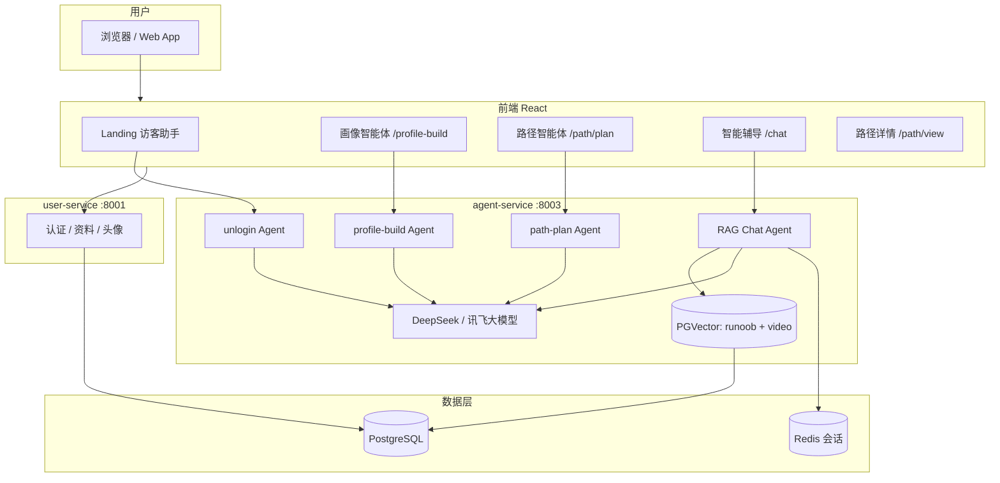
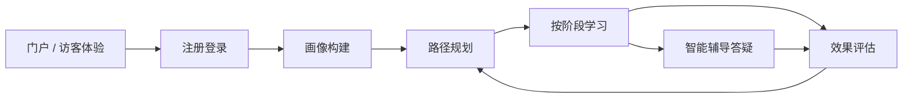

# 系统设计总览

> 本文描述项目的**发展方向**、**模块职责**与**开发路线**，供团队对齐赛题要求与分工。  
> 接口细节见 [frontend/待与后端同步清单.md](../frontend/待与后端同步清单.md)。

---

## 1. 项目定位

### 1.1 赛题目标

面向高等教育场景，利用大模型与多智能体技术，实现：

1. **对话式学习画像** — 自然语言构建 ≥6 维动态学生画像  
2. **多智能体协同资源生成** — 至少 5 类多模态学习资料  
3. **个性化学习路径规划与推送** — 分阶段路径 + 精准资源投递  
4. **智能辅导**（加分）— 即时答疑、多模态解答  
5. **学习效果评估**（加分）— 行为追踪、方案动态优化  

### 1.2 产品名称与风格

- **产品名**：智慧学习中心  
- **视觉**：专业学术科技风（青墨主色、毛玻璃、流式对话、Markdown + 资源卡片）  
- **切入点课程**：以数据结构 / 计算机相关课程为演示知识库（Runoob 文字 + B 站视频向量库）

### 1.3 发展方向（中长期）

| 阶段 | 目标 | 说明 |
|------|------|------|
| **P0 · 初赛可演示** | 端到端主流程跑通 | 登录 → 画像 → 路径 → 资源浏览 → 辅导问答 |
| **P1 · 多智能体实装** | 各 Agent 独立 API + 编排 | profile-build / path-plan / resource-gen 分工清晰 |
| **P2 · 质量与安全** | 防幻觉、敏感词、引用溯源 | 知识库片段与视频链接可追溯 |
| **P3 · 评估闭环** | 练习/行为回写画像与路径 | analytics 驱动推送策略调整 |

---

## 2. 多智能体架构

### 2.1 智能体角色定义

| 智能体 | 路由入口 | 职责 | 后端接口（规划） | 当前状态 |
|--------|----------|------|------------------|----------|
| **引导智能体** | Landing 访客抽屉 | 3 轮免费体验、引导登录 | `POST /api/agent/unlogin/chat` | 已对接 |
| **画像智能体** | `/profile-build` | 多轮抽取专业/目标/薄弱点，生成六维画像 | `POST /api/agent/profile-build` | 前端 Mock，可切 `VITE_PROFILE_BUILD_API=1` |
| **路径智能体** | `/path/plan` | 读画像，规划三阶段路径与五类资源 | `POST /api/agent/path-plan` + `POST /api/learning-path/generate` | 前端 Mock |
| **辅导智能体** | `/chat` | 知识库 RAG 答疑、资源意图 | `POST /api/agent/chat` | 已对接（RAG 文字；视频表待接入） |
| **资源智能体** | （规划中） | 协同生成文档/导图/题库/视频/实操 | 资源服务 + LLM 工具链 | 待开发 |
| **评估智能体** | `/analytics` | 薄弱点分析、推送策略建议 | `GET /api/analytics/*` | 前端 Mock |

> **原则**：画像与路径对话**不**走知识库 Chat，避免与辅导混淆；会话分别存于 `profileBuildMessages` / `pathPlanMessages` / `tutorMessages`。

---

## 3. 用户主流程

### 3.1 前端门禁（已实现）

- 未完成画像 → 无法进入 **智能辅导**（跳转画像页并提示）  
- 未完成画像 → 无法进入 **路径规划**（跳转画像页并提示）  
- 画像完成判定：`learnerDimensions` 含 `source: "对话画像构建"`

---

## 4. 模块划分与开发方向

### 4.1 前端 `frontend/`

| 模块 | 目录/页面 | 功能 | 开发方向 |
|------|-----------|------|----------|
| **门户** | `pages/Landing.tsx` | 赛题介绍、访客 FAB 对话 | 完善 FAQ、性能与动效 |
| **认证** | `pages/Login.tsx` 等 | 邮箱/用户名/验证码登录 | 已接 user-service；refreshToken 字段对齐 |
| **工作台** | `pages/Home.tsx` | 画像未完成引导 / 完成后驾驶舱 | 接 `GET /api/profile` |
| **画像** | `Chat.tsx` @ `/profile-build`、`pages/Profile.tsx` | 构建 + 六维雷达 | 接 profile-build API + profile 持久化 |
| **辅导** | `Chat.tsx` @ `/chat` | RAG 对话、快捷指令 | 视频 RAG、SSE、反馈/附件 |
| **路径** | `LearningPath` / `PathPlan` / `PathDetail` | 中心 → 规划 → 详情 | 接 path-plan + learning-path API |
| **资源** | `ResourceDetail`、`ExercisePage` | 五类资源展示与练习 | `GET resources` / `POST exercises/submit` |
| **评估** | `Analytics.tsx` | 图表、薄弱点、建议 | analytics 服务 |
| **账户** | `Account.tsx` | 资料、头像、统计 | getProfile / stats 稳定化 |
| **状态** | `store/useAppStore.ts` | 全局画像、路径、消息 | 联调后以服务端为准，减少 localStorage 依赖 |

**联调文档**：`frontend/待与后端同步清单.md`、`frontend/BACKEND_INTEGRATION.md`

### 4.2 后端微服务（规划 vs 现状）

| 服务 | 目录 | 端口 | 职责 | 现状 |
|------|------|------|------|------|
| **user-service** | `backend/user-service` | 8001 | 认证、个人资料、头像 | **已运行** |
| **agent-service** | `backend/agent-service` | 8003 | 多智能体对话、RAG | **部分完成**（chat / unlogin） |
| **learn-service** | 规划中 | — | 路径、资源、练习 CRUD | 待建 |
| **analytics-service** | 规划中 | — | 学习行为与评估 | 待建 |

### 4.3 数据与知识库

| 数据 | 存储 | 用途 | 开发方向 |
|------|------|------|----------|
| 用户与资料 | PostgreSQL（user-service） | 账号、昵称、专业等 | 与画像表关联 |
| 学习画像 | PostgreSQL（待统一） | 六维 `LearningProfile` | profile API |
| 学习路径 | PostgreSQL（待建） | stages / topics / resources | learning-path API |
| 文字知识库 | `knowledge_chunks` + PGVector | Runoob 教程 RAG | 已入库 |
| 视频知识库 | `video_resources` + PGVector | B 站教程 RAG | **待接入检索** |
| 对话上下文 | Redis | session 多轮 | chat 已用 |

### 4.4 脚本与工具

| 路径 | 说明 |
|------|------|
| `scripts/runoob_crawler_full.py` | 教程爬虫与入库 |
| `frontend/vite.config.ts` | 开发代理（8001 / 8003） |

---

## 5. 赛题能力 ↔ 交付物映射

| 赛题要求 | 系统体现 | 演示建议 |
|----------|----------|----------|
| 6 维画像 | Profile 雷达图 + 对话构建 | 现场 2 轮对话 → 完成画像 |
| 5+ 资源类型 | Path 详情五类卡片 + ResourceTypeStrip | 展示文档/导图/题/视频/实操 |
| 多智能体 | 画像 / 路径 / 辅导 分路由分 Agent | 架构图 + 对话对比 |
| 路径推送 | 三阶段 PathDetail | 按薄弱点生成阶段 |
| 防幻觉 | 敏感词本地 + 规划 safety API | 说明 RAG 引用片段 |
| 流式体验 | simulateStream + 规划 SSE | Chat 打字效果 |

---

## 6. 近期迭代建议（团队分工参考）

1. **agent-service**：实现 `profile-build`、`path-plan`；`chat` 接入 `video_resources` 检索  
2. **learn 模块**：`GET/POST /api/learning-path`、`GET /api/resources/:id`  
3. **前端**：登录后拉取 profile/path，去掉关键路径 Mock  
4. **文档**：OpenAPI 与 handoff 同步；初赛 PPT 按 §5 能力逐条演示  
5. **部署**：Docker Compose 一键起 user + agent + PG + Redis  

---

## 7. 相关文档

- [docs/INDEX.md](../INDEX.md) — 文档导航  
- [agent_docs/chat.md](../agent_docs/chat.md) — RAG Chat  
- [learning_flow/profile-build.md](../learning_flow/profile-build.md) · [path-plan.md](../learning_flow/path-plan.md)  
- [guides/git.md](../guides/git.md) — 协作规范  

---

*维护：模块或 Agent 变更时请更新本节与根目录 README 的「文档索引」表。*
